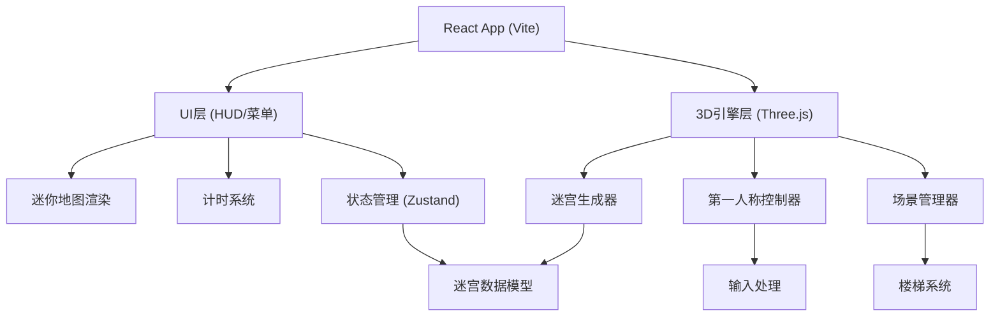

## 1. 架构设计



## 2. 技术描述

- **前端框架**：React@18 + TypeScript + Vite
- **3D引擎**：Three.js（原生Three.js，性能最优）
- **样式方案**：TailwindCSS@3
- **状态管理**：Zustand
- **初始化工具**：vite-init
- **后端**：无（纯前端游戏）
- **数据库**：无

## 3. 路由定义

| 路由 | 用途 |
|-------|---------|
| / | 游戏主入口（包含菜单和游戏场景） |

## 4. 数据模型

### 4.1 迷宫数据结构

```typescript
// 单元格类型
enum CellType {
  WALL = 'wall',
  FLOOR = 'floor',
  STAIRS_UP = 'stairs_up',
  STAIRS_DOWN = 'stairs_down',
  EXIT = 'exit',
  START = 'start',
}

// 单个单元格
interface Cell {
  x: number;
  z: number;
  type: CellType;
  walls: { north: boolean; south: boolean; east: boolean; west: boolean };
  connectsTo?: { floor: number; x: number; z: number }; // 楼梯连接点
}

// 单层迷宫
interface MazeFloor {
  level: number;
  width: number;
  depth: number;
  cells: Cell[][];
  startPos: { x: number; z: number };
  exitPos?: { x: number; z: number };
}

// 完整多层迷宫
interface Maze {
  floors: MazeFloor[];
  currentFloor: number;
  playerPos: { x: number; z: number; floor: number };
  exitPos: { x: number; z: number; floor: number };
}

// 游戏状态
interface GameState {
  status: 'menu' | 'playing' | 'won';
  difficulty: 'easy' | 'normal' | 'hard';
  elapsedTime: number;
  bestTime: number | null;
  maze: Maze | null;
}
```

## 5. 项目结构

```
src/
├── components/
│   ├── GameCanvas.tsx      # Three.js画布容器
│   ├── HUD.tsx             # 游戏HUD（迷你地图、计时器）
│   ├── MainMenu.tsx        # 开始菜单
│   ├── MiniMap.tsx         # 迷你地图组件
│   └── WinScreen.tsx       # 通关结算界面
├── hooks/
│   ├── useGameStore.ts     # Zustand游戏状态
│   └── useTimer.ts         # 计时器Hook
├── game/
│   ├── MazeGenerator.ts    # 迷宫生成算法
│   ├── PlayerController.ts # 第一人称控制器
│   ├── SceneManager.ts     # Three.js场景管理
│   └── types.ts            # 游戏类型定义
├── pages/
│   └── GamePage.tsx        # 游戏主页面
├── utils/
│   └── helpers.ts          # 工具函数
├── App.tsx
├── main.tsx
└── index.css
```
