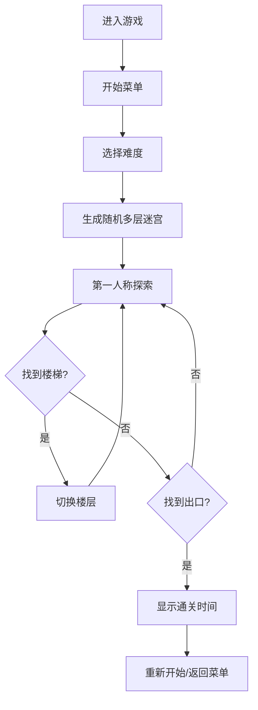

## 1. 产品概述

3D多层迷宫探险游戏 - 第一人称视角在多层立体迷宫中寻找出口，通过楼梯连接上下楼层，配合迷你地图考验玩家方向感与空间思维能力。

- 面向喜欢益智解谜、3D探索类游戏的玩家
- 提供沉浸式迷宫探索体验，训练空间感知能力

## 2. 核心功能

### 2.1 功能模块

1. **游戏主界面**：开始菜单、难度选择、游戏说明
2. **3D迷宫场景**：多层立体迷宫、墙壁、地板、天花板、楼梯
3. **第一人称控制**：WASD移动、鼠标视角旋转、碰撞检测
4. **迷你地图**：右上角实时显示当前楼层布局、玩家位置、出口位置、楼梯位置
5. **计时系统**：实时计时、通关记录显示
6. **多层楼梯系统**：上下楼层切换、楼梯连接动画

### 2.2 页面详情

| 页面名称 | 模块名称 | 功能描述 |
|-----------|-------------|---------------------|
| 开始菜单 | 标题与按钮 | 游戏标题、开始游戏按钮、难度选择、操作说明 |
| 游戏主场景 | 3D渲染 | 渲染多层迷宫、玩家视角、光影效果 |
| HUD界面 | 迷你地图 | 实时渲染当前楼层迷你地图，玩家朝向、出口标记、楼梯标记 |
| HUD界面 | 计时器 | 显示当前游戏时长、楼层信息 |
| 通关界面 | 结算面板 | 显示通关时间、最佳记录、重新开始按钮 |

## 3. 核心流程

玩家进入游戏 → 选择难度 → 生成随机多层迷宫 → 第一人称探索（WASD移动+鼠标转向）→ 通过楼梯在楼层间穿梭 → 找到出口 → 显示通关时间 → 可选择重新开始

## 4. 用户界面设计

### 4.1 设计风格
- **主色调**：深邃的石板灰 `#2d3436` 作为主背景，搭配琥珀金 `#d4a017` 作为强调色
- **辅助色**：幽蓝 `#0984e3` 表示出口，翠绿 `#00b894` 表示楼梯
- **按钮风格**：圆角矩形按钮，悬浮时发光效果，3D立体感
- **字体**：使用 'Orbitron' 科幻风格显示字体 + 'Noto Sans SC' 中文正文字体
- **布局风格**：沉浸式全屏3D场景，HUD叠加式UI
- **视觉效果**：深色迷宫内部带点光源手电筒效果，营造探险氛围

### 4.2 页面设计概览

| 页面名称 | 模块名称 | UI元素 |
|-----------|-------------|-------------|
| 开始菜单 | 主菜单 | 居中大标题、发光按钮、渐变背景、粒子效果 |
| 游戏场景 | 3D迷宫 | 石质墙壁纹理、地板网格、天花板、点光源、楼梯模型 |
| HUD界面 | 迷你地图 | 右上角半透明方框、玩家三角形箭头、彩色标记点 |
| HUD界面 | 信息栏 | 左上角计时器、楼层显示，简洁现代字体 |
| 通关界面 | 结算面板 | 居中毛玻璃卡片、大数字时间、装饰性边框 |

### 4.3 响应式
- 桌面端全屏体验，键盘+鼠标操作
- 游戏画布自适应窗口大小
- HUD元素固定在屏幕角落，不随窗口拉伸变形

### 4.4 3D场景指引
- **环境氛围**：昏暗迷宫内部，带有神秘探险气息
- **光照设置**：玩家位置处放置聚光灯模拟手电筒效果，环境光较低营造氛围
- **相机设置**：第一人称视角，FOV约75度，眼高约1.6单位
- **构图重点**：迷宫走廊纵深、楼梯的垂直空间感
- **交互效果**：移动时头部轻微晃动、楼梯切换时平滑过渡动画
- **后处理效果**：轻微晕影(vignette)、抗锯齿
